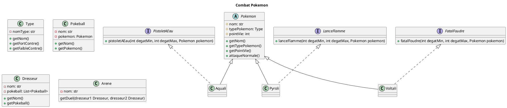

## UML - Diagramme de classe 

### ENONCÉ

Objectif

En utilisant les éléments appris, vous devez créer la logique d'un jeu de combat de Pokemon. Le jeu doit permettre à deux dresseurs de combattre dans une arène.

Par souci de simplicité, nous n'aurons que 3 types de pokémons : feu, eau et plante.

Libre à vous de rajouter des pokémons et des types si vous le souhaitez !

Règles
L'idée des Pokemons est de créer un jeu de combat au tour par tour. Si vous avez une autre idée, vous pouvez la réaliser en lieu et place ! Ceci dit : Vous devez reprendre l'idée globale des Pokemons en termes de mécaniques de jeu.

Quelques exemples :

Combat de robots dans une arène
Dungeon Crawler type RPG
Combat de licornes
Mon petit poney : version hardcore
Conception
Vous devrez réaliser un diagramme de classe pour votre jeu. Réfléchissez à tous les impacts, l'évolutivité, etc.

Il vous appartiendra de coder ensuite votre jeu en respectant les principes de la POO !

À l'issue, vous devrez réaliser une présentation de 5mn pour présenter votre diagramme de classe, suivi d'une démonstration de votre jeu.

Rendu
Le repository
Vous devrez créer un répository sur votre compte Github. Le README.md doit contenir le diagramme de classe ainsi que les User Stories.

Le code
Vous réaliserez votre code en Java. Vous porterez une attention particulière à la qualité de votre code :

Découpage
Documentation
Nomenclature
La présentation
Vous devrez réaliser une présentation de 5mn pour présenter votre diagramme de classe. Lors de cette présentation, vous devrez :

Expliquer votre diagramme de classe et justifier vos choix
Réaliser une petite démonstration de votre jeu
Si vous avez créé votre propre jeu, vous avez 5mn de présentation pour expliquer les règles du jeu.

L'over-engineering est toléré si conscient et justifié !

L'évaluation
Vous serez évalué sur :

La qualité/lisibilité de votre code
Respect des principes de la POO
Gestion du Git (messages, fréquence, etc.)
La conception :
Vos choix sont conscients et justifiés
Votre diagramme de classe est cohérent.
La présentation en elle-même :
La présentation est claire et compréhensible
La démonstration est fonctionnelle
La documentation (README) :
Le diagramme de classe est présent
Les User Stories sont présentes
Le suivi général des consignes
Vous avez réalisé un jeu de combat au tour par tour en implémentant les fonctionnalités attendues
Fonctionnalités
Ci-après la liste des fonctionnalités attendues si vous réalisez un jeu de combat de Pokemons. Si vous préférez réaliser un autre jeu, vous devrez réaliser une liste de fonctionnalités équivalente.

Libre à vous de rajouter des fonctionnalités si vous le souhaitez !

Les types
Chaque pokémon a un type (feu, eau, plante, etc.)
Chaque type a des faiblesses et des résistances contre d'autres types
Les attaques
Chaque attaque a un type
Chaque pokémon a au moins une attaque de type "normal"
Chaque pokémon peut avoir une ou plusieurs attaques de son type
Chaque attaque a un nom et une puissance (min et max)
Le calcul des dégats d'une attaque est aléatoire entre la puissance min et max
Les points de vie
Chaque pokémon a un nombre de points de vie maximum
Chaque pokémon a un nombre de points de vie restants
Chaque attaque fait perdre des points de vie au pokémon attaqué
Les pokeballs
Un dresseur peut avoir jusqu'à 6 pokémons dans son équipe
Ils sont contenus dans des pokeballs
Chaque pokeball peut contenir un pokémon
L'arène
Un combat se déroule dans une arène
Un combat se déroule au tour par tour
Un combat se termine quand un des dresseurs n'a plus de pokémon en état de combattre
Un dresseur peut changer de pokémon pendant un combat
Un dresseur peut attaquer avec son pokémon pendant un combat
Les faiblesses
Un pokémon est plus fort contre certains types de pokémon
Un pokémon est plus faible contre certains types de pokémon
Lorsqu'il subit une attaque d'un type auquel il est faible, il perd deux fois plus de points de vie
Lorsqu'il subit une attaque d'un type auquel il est résistant, il perd deux fois moins de points de vie
Les attaques neutres ne sont pas affectées par les faiblesses
User Stories
Feature: Les types de Pokemon
En tant que dresseur,
Je veux savoir quel est le type d'un pokemon
Pour pouvoir choisir le meilleur pokemon pour le combat

Scenario: Consulter le type d'un pokemon
Given je consulte la fiche de <pokemon>
When je demande son type
Then je dois obtenir <type>
Exemples:
| pokemon   | type |
| Salamèche | feu  |
| Carapuce  | eau  |
| Bulbizarre| plante|
Feature: Les attaques de Pokemon
En tant que dresseur,
Je veux savoir quelles sont les attaques d'un pokemon
Pour pouvoir choisir le meilleur pokemon pour le combat

Scenario: Consulter les attaques d'un pokemon
Given je consulte la fiche de <pokemon>
When je demande ses attaques
Then je dois obtenir <attaques>
Exemples:
| pokemon   | attaques |
| Salamèche | griffe, lance-flamme |
| Carapuce  | charge, pistolet à eau |
| Bulbizarre| charge, fouet lianes|
Feature: Les attaques
En tant que dresseur,
Je veux pouvoir ordonner à mon pokemon d'attaquer
Pour réduire les points de vie de l'adversaire

Scenario: Attaquer un pokemon
Given je suis en combat contre <pokemon>
When j'ordonne à mon pokemon d'attaquer avec <attaque>
Then le pokemon <pokemon> perd <degats> points de vie
Exemples:
| pokemon   | attaque | degats |
| Salamèche | griffe  | 10     |
| Carapuce  | charge  | 5      |
| Bulbizarre| charge  | 5      |

Scenario: Subir une attaque
Given je suis en combat avec <pokemon>
When son dresseur ordonne à son pokemon d'attaquer le miens avec <attaque>
Then mon pokemon perd <degats> points de vie
Exemples:
| pokemon   | attaque | degats |
| Salamèche | griffe  | 10     |
| Carapuce  | charge  | 5      |
| Bulbizarre| charge  | 5      |

Scenario: Calculer les degats
Given j'utilise une attaque
When je demande les degats
Then je dois obtenir des dégats entre <degats min> et <degats max>
Exemples:
| attaque   | degats min | degats max |
| griffe    | 5          | 10         |
| charge    | 2          | 5          |
| lance-flamme| 5        | 10         |
| pistolet à eau| 5       | 10         |
| fouet lianes| 5         | 10         |
Feature: Les points de vie
En tant que dresseur,
Je veux savoir combien de points de vie il reste à un pokemon
Pour savoir si je peux encore combattre

Scenario: Consulter les points de vie d'un pokemon
Given je consulte la fiche de <pokemon>
When il reste <pv restants> pv à mon pokemon
And il a <pv max> pv au maximum
Then je <combative> continuer à combattre
Exemples:
| pokemon   | pv restants | pv max | combative |
| Salamèche | 10          | 10     | peux      |
| Carapuce  | 5           | 10     | peux      |
| Bulbizarre| 0           | 10     | ne peux pas      |
Feature: Arène
En tant que dresseur,
Je veux pouvoir combattre un autre dresseur dans une arène
Pour savoir qui est le meilleur dresseur

Scenario: Combattre un autre dresseur
Given je suis Sacha
When je provoque Régis en duel
Then nous combattons dans l'arène

Scenario: Combattre au tour par tour
Given je suis Sacha
When c'est mon tour de jouer
Then je peux <réaliser une aciton>
Exemples:
| réaliser une action |
| attaquer            |
| changer de pokemon  |

Scenario: Changer de Pokemon
Given je suis Sacha
When je change de pokemon
Then j'ai réalisé mon action
And c'est au tour de Régis de jouer

Scenario: Gagner un combat
Given je suis Sacha
When Régis n'a plus de pokemon en état de combattre
Then je gagne le combat
Feature: Faiblesse
En tant que pokemon,
Je veux être plus fort contre certains types de pokemon
Pour pouvoir gagner plus facilement

    Scenario: Consulter les faiblesses d'un pokemon
      Given je consulte la fiche de <pokemon>
      When je demande ses faiblesses
      Then je dois obtenir <faiblesses>
    Exemples:
    | pokemon   | faiblesses |
    | Salamèche | plante     |
    | Carapuce  | feu        |
    | Bulbizarre| eau        |

    Scenario: Attaquer un type sensible au miens
        Given je suis un pokemon de type <type>
        When j'attaque un pokemon de type <type faible>
        Then les dégats sont doublés
    Exemples:
    | pokemon   | type | type faible | faiblesses |
    | Salamèche | feu  | plante      | plante     |
    | Carapuce  | eau  | feu         | feu        |
    | Bulbizarre| plante| eau        | eau        |

    Scenario: Subir une attaque d'un type auquel je suis résistant
        Given je suis un pokemon de type <type>
        When je subis une attaque d'un pokemon de type <type faible>
        Then les dégats sont divisés par deux
    Exemples:
    | pokemon   | type | type faible | faiblesses |
    | Salamèche | feu  | plante      | plante     |
    | Carapuce  | eau  | feu         | feu        |
    | Bulbizarre| plante| eau        | eau        |

    Scenario: Subir une attaque d'un type auquel je suis sensible
        Given je suis un pokemon de type <type>
        When je subis une attaque d'un pokemon de type <type faible>
        Then les dégats sont doublés
    Exemples:
    | pokemon   | type | type faible | faiblesses |
    | Salamèche | feu  | eau         | eau        |
    | Carapuce  | eau  | plante      | plante     |
    | Bulbizarre| plante| feu        | feu        |

    Scenario: Subir une attaque d'un type auquel je suis ni résistant et sensible
        Given je suis un pokemon de type <type>
        When je subis une attaque d'un pokemon de type <type>
        Then les dégats sont normaux
    Exemples:
    | pokemon   | type | type faible | faiblesses |
    | Salamèche | feu  | feu         | feu        |
    | Carapuce  | eau  | eau         | eau        |
    | Bulbizarre| plante| plante     | plante     |
Feature: Pokeballs
En tant que dresseur,
Je veux pouvoir porter 6 pokemon maximum
Pour pouvoir en changer pendant un combat

    Scenario: Consulter le nombre de pokemon
      Given je suis Sacha
      When je consulte mon équipe
      Then je dois avoir <nb pokemon> pokemon

    Scenario: Ajouter un pokemon
        Given je suis Sacha
        When j'ajoute un pokemon à mon équipe
        And j'ai déjà <nb pokemon> pokemon
        Then j'ai <nb pokemon + 1> pokemon
    Exemples:
    | nb pokemon | 
    | 1          |
    | 2          |
    | 3          |
    | 4          |